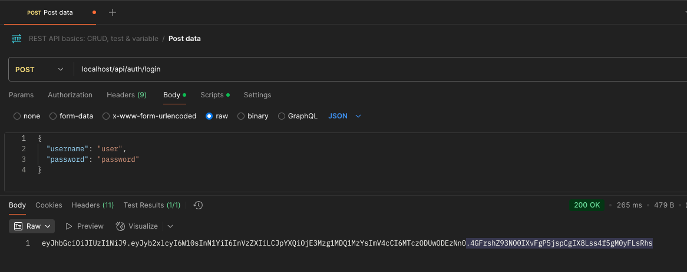
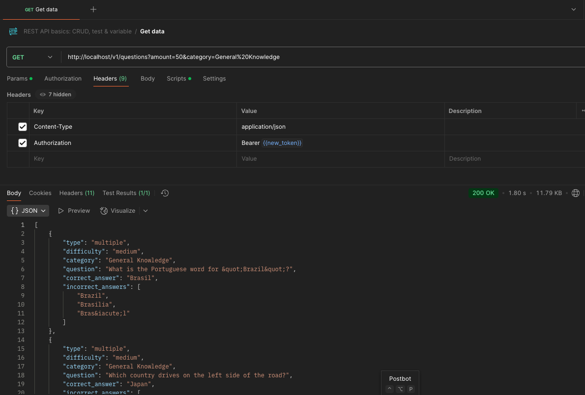

# Trivia Question API

## Overview
A Trivia Question API that retrieves questions from https://opentdb.com/. 
It uses Java 21, Spring Boot 3.4.1, and integrates with [any other tools you're using, like Kafka, Docker, etc.].


## Getting Started

1. Clone the repository:
   ```bash
   git clone https://github.com/markwaynedeclaro/question-api.git

2. Make sure you have installed/run docker on your machine.
####

3. Remove any running containers and existing question api images
   ```bash
   docker rm -f question-api-container
   docker container prune
   y
   docker rmi question-api

4. Build the docker image:
   ```bash
   docker build -t question-api .

5. Run the docker container:
   ```bash
   docker run -d --name question-api-container -p 80:80 question-api

##
## To check images and containers
- images
   ```bash
  docker images

- containers
   ```bash
  docker ps --all

##
## NOTES
* secret key (in application.properties) is generated from PasswordEncoderUtil
#####
* http://localhost/v1/questions?amount=50&category=General%20Knowledge will call
https://opentdb.com/api.php?amount=50&category=12&type=multiple

##
## API Docs
http://localhost/api-docs

##
## Swagger Page
1. Open http://localhost/swagger to view the swagger page
2. Run the POST endpoint /api/auth/login to get the token.
   ````JSON
   {
      "username": "user",
      "password": "password"
   }

Copy the token then input it on the Authorize button at the top right.
This will authorize you to run all the other endpoints

##
## POSTMAN Test

1. Get the token
   
2. Access http://localhost/v1/questions?amount=50&category=General%20Knowledge to test
   


##
## Actuator Pages 
   * http://localhost/actuator/health
   * http://localhost/actuator/info
   * http://localhost/actuator/metrics


##
1. ## Single click - commands to build and create a container running on port 80
   ```bash
   docker rm -f question-api-container
   docker container prune
   y
   docker rmi question-api
   docker build -t question-api .
   docker run -d --name question-api-container -p 80:80 question-api